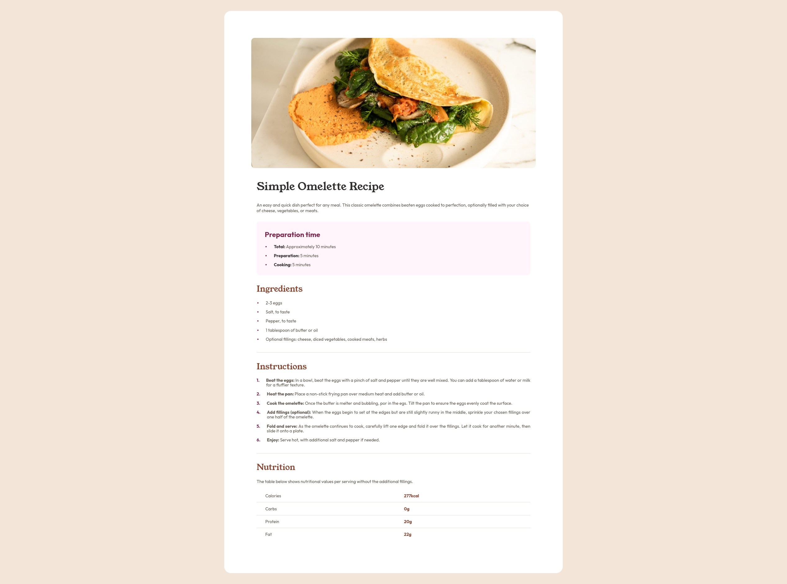
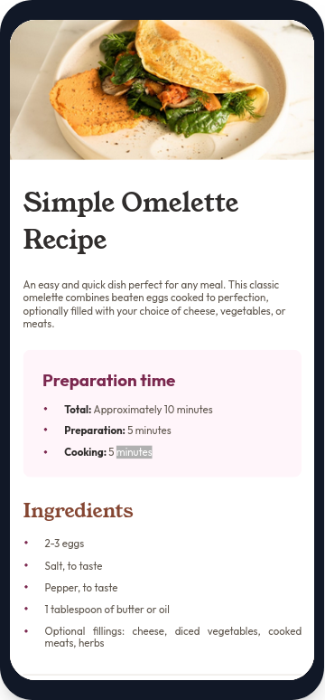

# Frontend Mentor - Recipe page solution

This is a solution to the [Recipe page challenge on Frontend Mentor](https://www.frontendmentor.io/challenges/recipe-page-KiTsR8QQKm). Frontend Mentor challenges help you improve your coding skills by building realistic projects. 

## Table of contents

- [Overview](#overview)
  - [The challenge](#the-challenge)
  - [Screenshot](#screenshot)
  - [Links](#links)
- [My process](#my-process)
  - [Built with](#built-with)
  - [What I learned](#what-i-learned)
  - [Continued development](#continued-development)

**Note: Delete this note and update the table of contents based on what sections you keep.**

## Overview

### Screenshot

### Links

- Solution URL: [Repository](https://github.com/SaucDev/Recipe-page)
- Live Site URL: [Live page](https://your-live-site-url.com)

## My process

### Built with

- Semantic HTML5 markup
- CSS custom properties
- Flexbox
- Mobile-first workflow

### What I learned
I learnt to create a deeper responsive design to accomodate mobile users, homogenized as much as i could along the way, also learnt about line height and the quirks with flex on <li> elements, after pseudoelements and the first time i created a table.

### Continued development

I could see the css file could get messy pretty quick so im focusing on homogenizing my design to be easier to understand and touch up for latter commits.
